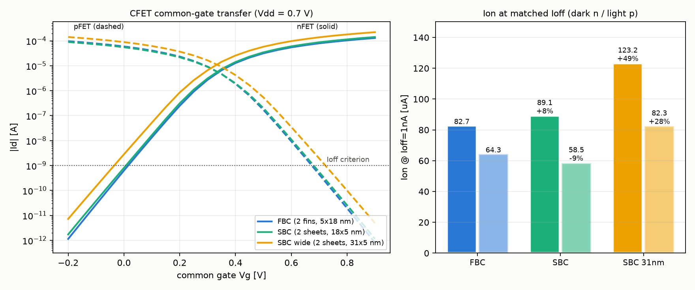

# 论文复现:Fin-based vs Sheet-based CFET(器件级)

对标 Jiang et al. (Applied Materials), *Complementary FET Device and Circuit Level Evaluation Using Fin-Based and Sheet-Based Configurations Targeting 3nm Node and Beyond* (IEEE).

论文 Fig.2 参数:Lg 15nm / gate pitch 45nm / N-P 间距 30nm / sheet 18x5nm / fin 5x18nm / 每器件 2 片(fin) / Vdd 0.7V。本仿真:`configs/paper_{fbc,sbc,sbc31}_cfet_3d.yaml`,DD + doping_vsat,面取向迁移率经 `physics.mobility_scale_n/p` 标定(FBC (110): 0.75/1.40;SBC (100): 1.0/1.0,文献典型比值)。

## Ion @ Ioff=1nA(恒流法,与论文 Ion-Ioff 对比口径一致)

| 构型 | Ion_n [uA] | ΔIon_n | 论文 ΔIon_n | Ion_p [uA] | ΔIon_p | 论文 ΔIon_p |
|---|---|---|---|---|---|---|
| FBC (2 fins, 5x18 nm) | 82.73 | (基准) | (基准) | 64.32 | (基准) | (基准) |
| SBC (2 sheets, 18x5 nm) | 89.13 | +7.7% | +10% | 58.47 | -9.1% | -5% |
| SBC wide (2 sheets, 31x5 nm) | 123.17 | +48.9% | +73% | 82.34 | +28.0% | +47% |

## 静电完整性(本仿真提取)

| 构型 | SS_n [mV/dec] | SS_p [mV/dec] |
|---|---|---|
| FBC (2 fins, 5x18 nm) | 72.2 | 72.3 |
| SBC (2 sheets, 18x5 nm) | 74.0 | 73.7 |
| SBC wide (2 sheets, 31x5 nm) | 76.4 | 76.1 |

## 差异来源(预期内)

- **fin 用旋转 GAA 近似**(四面环栅 vs 论文三栅带底部寄生器件):静电略优于真实 fin,且没有论文 SBC pMOS 的寄生底器件电容项;
- **迁移率取向比取文献典型值**(0.75/1.40),论文是向 sub-band BTE 逐条曲线标定——绝对电流不可比,相对趋势可比;
- **未建应力模型**:论文对两种构型的 pMOS 同等施加 500MPa 压应力,在相对比较中近似抵消;
- **量子修正未开启**(3D DG 成本考虑),5nm 沟道的 Vt 偏移在恒流法对齐 Ioff 后对 ΔIon 影响为二阶;
- **环振(RO)不在范围内**:需要寄生 RC 提取与瞬态仿真;本框架的电路级能力为 CFET 反相器 VTC(混合器件/电路求解)。

结论:器件级趋势与论文一致 —— SBC nMOS 因 (100) 面电子迁移率占优而领先 FBC,SBC pMOS 因空穴迁移率劣势而落后,加宽 sheet (31nm) 后 n/p 同时大幅领先(有效沟道宽度增加)。
